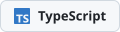

# Profile Cards Action

[](https://github.com/marketplace/actions/profile-cards)
[](https://github.com/seijikohara/profile-cards-action/releases)
[](https://github.com/seijikohara/profile-cards-action/actions)
[](LICENSE)

A GitHub Action that renders profile README cards as SVG from the GitHub GraphQL API. It produces an overview card, contribution history, streaks, contribution composition, activity rhythm, and a language treemap, and can commit the generated files back to your repository.

## Overview

Profile READMEs usually rely on third-party image services that fetch your stats on every page view. This action renders the cards itself inside your own workflow and writes plain SVG files into your repository, so the images are self-hosted, reproducible, and theme-aware (light and dark).

Each requested card is rendered per theme into `<output-dir>/` as `<card>.<theme>.svg`. Optional badge pills are rendered into `<output-dir>/badges/` as `<slug>.<theme>.svg`, using [simple-icons](https://simpleicons.org/) for brand glyphs when a match exists and falling back to text-only pills otherwise.

| Card            | Shows                                                                                                                                                       |
| --------------- | ----------------------------------------------------------------------------------------------------------------------------------------------------------- |
| `overview`      | Eight stat tiles: lifetime and current-year contributions, stars, followers, merged PRs, issues, public repositories, recently contributed-to repositories. |
| `lifetime`      | Contribution history — one row per year since the first contribution, each week shaded by activity.                                                         |
| `contributions` | Current and longest streaks, plus the trailing 12 months as an isometric 3D calendar.                                                                       |
| `composition`   | Per-year stacked bars of commits, pull requests, issues, reviews, and private contributions, with the overall private share.                                |
| `rhythm`        | Contributions by weekday and by month of the year.                                                                                                          |
| `languages`     | A treemap of languages by bytes across public source repositories, with a labeled legend.                                                                   |

Cards are drawn at the 846px width of the profile README column, use GitHub's Primer color tokens so they blend into both themes, animate only on entry (CSS only, disabled under `prefers-reduced-motion`), and contain no scripts or external references.

## Examples

Everything below is unmodified output: this action rendering the live profile of [@seijikohara](https://github.com/seijikohara). [`.github/workflows/examples.yml`](.github/workflows/examples.yml) re-runs the action against the same profile and commits the result to [`examples/`](examples/), so the gallery stays current on its own. The table above says what each card shows.

Each sample is wrapped in a `<picture>`, so the card you see matches your GitHub theme.

**`overview`** — profile stat tiles

<picture>
  <source media="(prefers-color-scheme: dark)" srcset="examples/overview.dark.svg" />
  
</picture>

**`lifetime`** — one shaded row per contribution year

<picture>
  <source media="(prefers-color-scheme: dark)" srcset="examples/lifetime.dark.svg" />
  
</picture>

**`contributions`** — streaks and an isometric trailing year

<picture>
  <source media="(prefers-color-scheme: dark)" srcset="examples/contributions.dark.svg" />
  
</picture>

**`composition`** — what the contributions are made of

<picture>
  <source media="(prefers-color-scheme: dark)" srcset="examples/composition.dark.svg" />
  
</picture>

**`rhythm`** — when the contributions happen

<picture>
  <source media="(prefers-color-scheme: dark)" srcset="examples/rhythm.dark.svg" />
  
</picture>

**`languages`** — language treemap by bytes

<picture>
  <source media="(prefers-color-scheme: dark)" srcset="examples/languages.dark.svg" />
  
</picture>

Badge pills render at their natural size. `GitHub`, `TypeScript`, and `npm` match a simple-icons glyph; `Findy` has none, so it falls back to a text-only pill:

<p>
  <picture>
    <source media="(prefers-color-scheme: dark)" srcset="examples/badges/github.dark.svg" />
    
  </picture>
  <picture>
    <source media="(prefers-color-scheme: dark)" srcset="examples/badges/typescript.dark.svg" />
    
  </picture>
  <picture>
    <source media="(prefers-color-scheme: dark)" srcset="examples/badges/npm.dark.svg" />
    
  </picture>
  <picture>
    <source media="(prefers-color-scheme: dark)" srcset="examples/badges/findy.dark.svg" />
    
  </picture>
</p>

## Usage

```yaml
name: Profile Cards

on:
  schedule:
    - cron: '0 0 * * *'
  workflow_dispatch:

permissions:
  contents: write

jobs:
  cards:
    runs-on: ubuntu-latest
    steps:
      - name: Checkout
        uses: actions/checkout@v7

      - name: Render profile cards
        uses: seijikohara/profile-cards-action@v0
        with:
          github-token: ${{ secrets.GITHUB_TOKEN }}
          username: seijikohara
          cards: overview,lifetime,contributions,composition,rhythm,languages
          output-dir: assets
          themes: light,dark
          commit: true
          # Optional: one brand name per line, rendered as badge pills.
          badges: |
            LinkedIn
            Qiita
            npm
```

`actions/checkout` must run first so the action can read the working tree and commit generated files back to it.

Embed the results in your README with a `<picture>` per card so each theme is served to the matching viewer:

```html
<picture>
  <source media="(prefers-color-scheme: dark)" srcset="./assets/overview.dark.svg" />
  
</picture>
```

Badge SVGs carry no links — wrap each one in an `<a href="...">` in your README to make it clickable.

## Inputs

| Input            | Description                                                                                                                                       | Required | Default                                                        |
| ---------------- | ------------------------------------------------------------------------------------------------------------------------------------------------- | -------- | -------------------------------------------------------------- |
| `github-token`   | Token for the GitHub GraphQL API and, when committing, for pushing generated files.                                                               | `true`   | —                                                              |
| `username`       | GitHub login to render. Defaults to the repository owner (`GITHUB_REPOSITORY_OWNER`).                                                             | `false`  | `''`                                                           |
| `cards`          | Cards to render (comma/space/newline separated).                                                                                                  | `false`  | `overview,lifetime,contributions,composition,rhythm,languages` |
| `output-dir`     | Directory to write card SVGs into.                                                                                                                | `false`  | `assets`                                                       |
| `themes`         | Themes to render (comma separated): `light`, `dark`.                                                                                              | `false`  | `light,dark`                                                   |
| `font`           | Google Fonts sans-serif family. Roboto and Roboto Mono are bundled; other families are fetched at runtime.                                        | `false`  | `Roboto`                                                       |
| `mono-font`      | Google Fonts monospace family.                                                                                                                    | `false`  | `Roboto Mono`                                                  |
| `badges`         | Newline-separated brand names to render as badge pills (icon via simple-icons when available, else text-only). Written to `<output-dir>/badges/`. | `false`  | `''`                                                           |
| `commit`         | Commit changed files back to the repository.                                                                                                      | `false`  | `true`                                                         |
| `commit-message` | Commit subject used when `commit` is true.                                                                                                        | `false`  | `chore(profile): refresh generated cards [skip ci]`            |

## Outputs

| Output    | Description                                              |
| --------- | -------------------------------------------------------- |
| `changed` | Whether any generated file changed (`"true"`/`"false"`). |
| `files`   | JSON array of written file paths.                        |

## How It Works

1. **Fetch** — Query the GitHub GraphQL API for the target user's profile, contribution calendar, and repository language statistics. The queries are split (one per contribution year) to stay far under the API's per-query resource limits.
2. **Resolve fonts** — Build the `@font-face` rules the cards reference (see [Fonts](#fonts)).
3. **Render** — Draw each requested card to SVG for every requested theme, embedding the fonts as Base64 data URIs so the cards need no external resources.
4. **Write** — Emit the SVGs into `output-dir` (and any badge pills into `output-dir/badges/`).
5. **Commit** — When `commit` is enabled, commit and push the changed files using `commit-message` (retrying with a rebase if the branch advanced mid-run), and report the `changed` / `files` outputs.

## Fonts

GitHub renders README images through ``, where SVGs cannot load external fonts — so the chosen faces are embedded directly in each card as Base64 woff2 data URIs.

- **Roboto and Roboto Mono (the defaults) are bundled** with the action, pre-subset to the glyphs the cards use. The default path performs no network request.
- **Any other Google Fonts family is fetched at run time** and embedded as-is. A variable family is embedded once under a weight range; a static family contributes one face per card weight, using the nearest available weight when an exact one is missing.
- An unknown family fails the run with `Invalid font "<name>". Specify a valid Google Fonts family.`

## Versioning

`v0` is a moving major tag. It is repointed at the newest `v0.0.x` release on every release, so `uses: seijikohara/profile-cards-action@v0` picks up patches without a workflow edit. Pin an exact tag (`@v0.0.4`) or a commit SHA instead when you need a reference that never changes.

Each patch version gets its own immutable release; see [Releases](https://github.com/seijikohara/profile-cards-action/releases) for the per-version notes. The action is still pre-1.0, so inputs and card layouts can change between `v0.0.x` releases.

## License

This project is licensed under the [MIT License](LICENSE).
